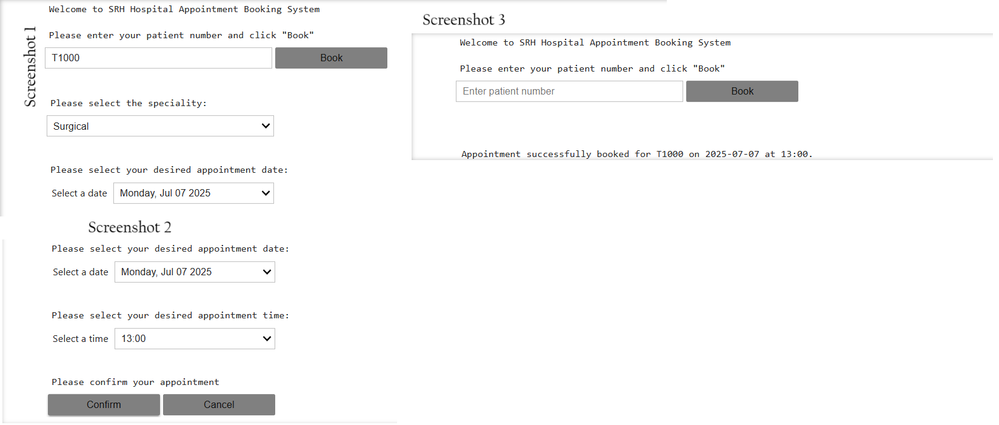

# Hospital Appointment Booking System

This is a simple Python-based, JupyterLab-built prototype Hospital Appointment Booking System which facilitates patients to book their medical appointment with the option to choose a speciality, and desired date and time.

---

## Features

- **Patient number input feature along with validation**  
  Only registered patients, who have been allocated a patient number by the hospital, can book the appointments.

- **Select medical specialty**  
  Patients can select their relevant speciality that they want to book an appointment with.

- **Filter available appointment dates and times**  
  Only available appointment dates and times will appear to the patients to avoid multiple patients getting the same appointment and exhausting the medical system.

- **Confirm or cancel appointments**  
  As a final stage, patients are given a confirm and cancel option to double-check before they go ahead and book the appointment.

- **Prevents double-booking for the same patient**  
  When the patient enters their patient number, if they already have an appointment, the system will inform them that they already have an appointment. This feature will avoid double bookings.

---

## Purpose

A traditional appointment system would require patients to contact the hospital either by phone, email, or by walking into the hospital to book their medical appointment. The hospital will offer the patient an appointment as per hospital availability which the patient will agree to take. This has two scenarios:

1. Administrative workload for the hospital.  
2. Less choice for the patient who will take the appointment either without realising they have other commitments — which happens often — or they will knowingly take the appointment to secure the spot thinking they will reschedule their other commitment. This will result in the patient cancelling their appointment last minute and the appointment slot, which could have been utilised, will go unused.

Considering how hospitals are struggling to issue appointments to the patients and the long waiting lists of patients waiting for their appointment, as well as to run the healthcare system more efficiently, we would want to run the clinics to their maximum capacity where all the appointment slots are taken and patients are seen so the flow of the patient is maintained.

An efficient healthcare system means that healthcare facility is extended to the maximum number of people and care facility provided in due course of time.

---

## Scope

This system facilitates patients where they can book their appointments from the comfort of their home, which improves customer care and access. It will reduce the cancellations as patients will be able to book their appointments as per their availability.

Furthermore, patients with disabilities will also be able to book their appointments without approaching the hospital — as an effective healthcare system offers maximum access.

The system is user-friendly and offers intuitive support. The users can simply perform one step at a time and the next step will appear — as a step-by-step led process without any confusion or overwhelming information all at once.

---

## Product Review

It is a simple appointment system and not heavily featured — unlike other appointment systems in the market. As this system is a prototype, it can be further improved according to the needs of the hospital. For example, some hospitals might require more specialities to be included or would like to customise specialities.

The system avoids duplications as well as functions as a reminder. For example, if a patient forgets their appointment and they try to rebook their appointment, as they input their patient number and click on 'Book', the system will remind them when they have their appointment and at what time. This benefits the hospital as well as they don't get duplicated appointments.

The confirm/cancel feature allows patients to rethink before confirming.

The times and dates only appear when they are available — as booked slots disappear from the patient view.

---

## Further Improvements/Additions

There are future additions that can be implemented to add further features and improvement to the current system such as:

- **Registering patient online**  
  The system only allows existing patients with hospital number/patient number to be able to book appointments.

- **Cancelling appointments**  
  Patients cannot cancel their appointment; they will have to contact the hospital to cancel their appointment. So, this limitation can be improved by allowing patients to be able to cancel their appointments. As this system is aimed at reducing cancellations, it does not include a cancellation feature.

- **Referrals**  
  This system does not allow first-time patients. So, a feature can be included where patients can upload their referral, register themselves, and book their appointment once their referral has been triaged and a patient number is issued by the hospital.

- **Medical Records (EHR)**  
  The system can include a feature where patients can access their medical records and access can be attached to their patient number — however, this feature will require two-way authentication or additional security features as well as patient consent to protect patient data.

- **Specialities**  
  Further specialities can be added, and parallel clinic appointments can also be added — some clinics run in parallel such as diabetes clinic and weight management clinics might run the same day, same time as hospitals have more doctors and more rooms to see the patients. The current system has every weekday assigned to one speciality. However, we can include many specialities for a single day and even divide them into morning/afternoon clinics.

- **Administration access**  
  Administration can be granted access to amend, update, and even book urgent appointments.

- **Doctor's duty roster**  
  The system can be synchronised with the doctor roster and appointment slots can be created as per their availability.

---

## Technological Stack

- Python 3  
- IPyWidgets  
- IPDisplay  
- JupyterLab

---

## Screenshots

> _Screenshot of the Appointment Booking UI in JupyterLab_

